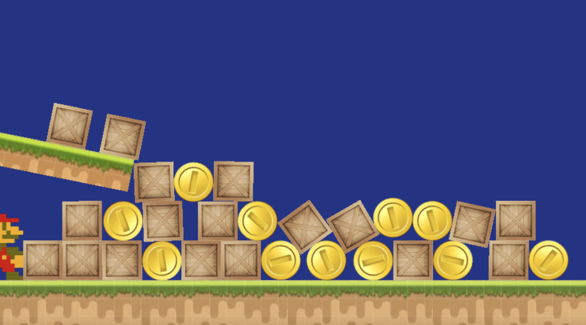

# Pixi Matters

Game demo using PixiJS, MatterJS with Typescript in OOP. The project is compiled using Parcel. 

[Try the demo here](https://kokodoko.github.io/piximatters/)



<br>
<br>
<br>

# Installing this example

First install [NodeJS](https://nodejs.org/en/). Then install all required libraries in one go. (PixiJS, MatterJS, Typescript and Parcel)

```
npm install
```

Start development in a live server
```
npm run start
```
Build the project for publication
```
npm run build
```


<br>
<br>
<br>

# Physics basics

In `Game.ts` we create a physics world. The physics world gets updated 60 times per second using Pixi's update loop. You can update your own sprites after the physics world has updated.

GAME.TS
```typescript
import Matter from 'matter-js'

class Game {
    onLoaded(){
        this.engine = Matter.Engine.create()
    }
    update() {
        Matter.Engine.update(this.engine, 1000 / 60)
        // update your sprites 
        // ...
    }
}

```
Sprites classes can create a `rigidBody` at the same size as their sprite image. The rigidbody has to be added to the physics simulation. You can add a label, this will be useful later for collision detection.

Then, every frame, the sprite reads the position of its own rigidBody, to know where to draw itself on the canvas. In other words: *MatterJS* creates the physics simulation, and *PixiJS* draws the sprites on the canvas.

FISH.TS
```typescript
class Fish extends PIXI.Sprite {
    constructor(texture:PIXI.Texture, game:Game) {
        super(texture)
        this.rigidBody = Matter.Bodies.rectangle(300, 30, 60, 60, {label:"Fish"}) //x,y,w,h
        Matter.Composite.add(game.engine.world, this.rigidBody)
    }
    update() {
        this.x = this.rigidBody.position.x
        this.y = this.rigidBody.position.y
        this.rotation = this.rigidBody.angle
    }
}
```

<br>
<br>
<br>

# Moving 

Rigidbodies move because `forces` are applied to them (gravity or other forces). This results in a `velocity` (current movement) of the sprite. You can always check the velocity using `console.log(this.rigidBody.velocity)`

To move a physics sprite yourself, you can alter the forces that affect the rigidbody. You can also directly set the velocity of the rigidbody. 

```typescript
// apply a upward force (jump)
Matter.Body.applyForce(this.rigidBody, { x: this.rigidBody.position.x, y: this.rigidBody.position.y }, { x: 0, y: -0.25 })

// set velocity directly
Matter.Body.setVelocity(this.rigidBody, { x: 10, y: 10 })
```

***Static elements*** have no forces applied to them, but can still collide with other physics elements. This is ideal for the ground and platforms.

```typescript
this.rigidBody = Matter.Bodies.rectangle(450, 480, 900, 100, { isStatic: true, label:"Ground" })
```

If your object only has to move through player interaction (a player character), then you can set `inertia` to false.

```typescript
 const playerOptions: Matter.IBodyDefinition = {
    inertia: Infinity,
    inverseInertia: Infinity,
    label: "Player"
}
this.rigidBody = Matter.Bodies.rectangle(600, 230, 75, 100, playerOptions)
```

<br>
<br>
<br>

# Collision

The best part of a physics engine is that you get detailed collision detection:

```typescript
class Game {
    onLoaded() {
        this.engine = Matter.Engine.create()
        Matter.Events.on(this.engine, 'collisionStart', (event) => this.onCollision(event))
    }
    onCollision(event: Matter.IEventCollision<Matter.Engine>) {
        let collision = event.pairs[0]
        let [bodyA, bodyB] = [collision.bodyA, collision.bodyB]
        console.log(`${bodyA.label} collides with ${bodyB.label}`)
    } 
}
```

<br>
<br>
<br>

# Links

- [PixiJS](https://pixijs.io/guides/basics/getting-started.html)
- [MatterJS](https://brm.io/matter-js/)
- [MatterJS Live Demos](https://brm.io/matter-js/demo/)
- [MatterJS API](https://brm.io/matter-js/docs/)

<br>
<br>
<br>

## PixiJS demos

- [Space Shooter](https://github.com/KokoDoko/pixidust)
- [Physics](https://github.com/KokoDoko/piximatters)
- [Flappy Bird](https://github.com/KokoDoko/pixibird.git)
